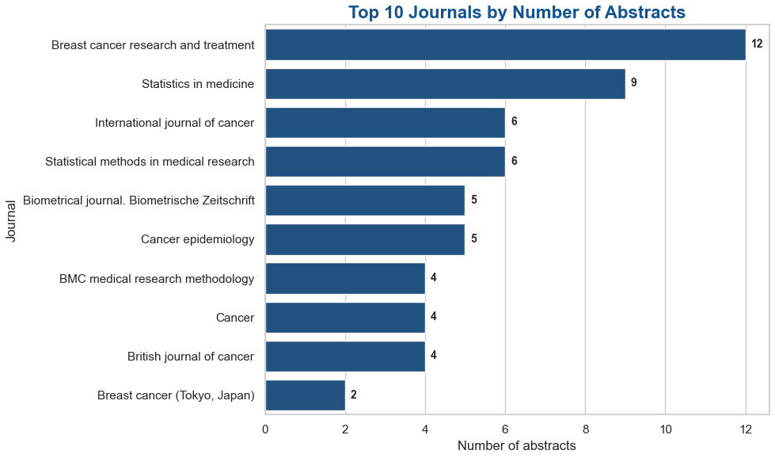
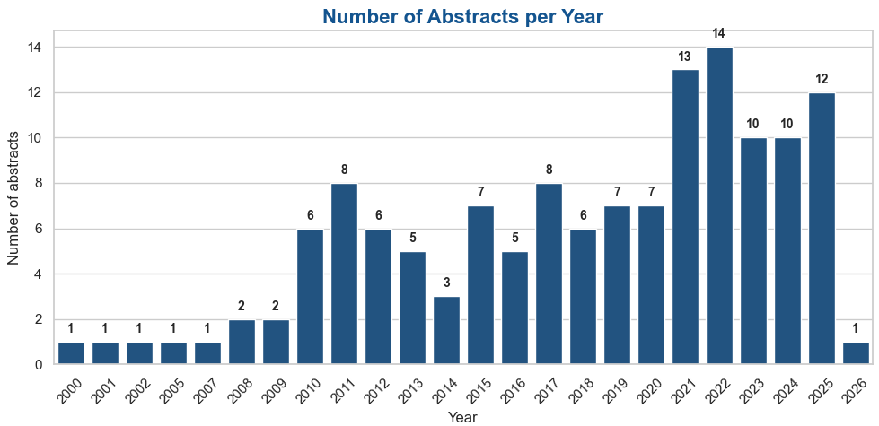
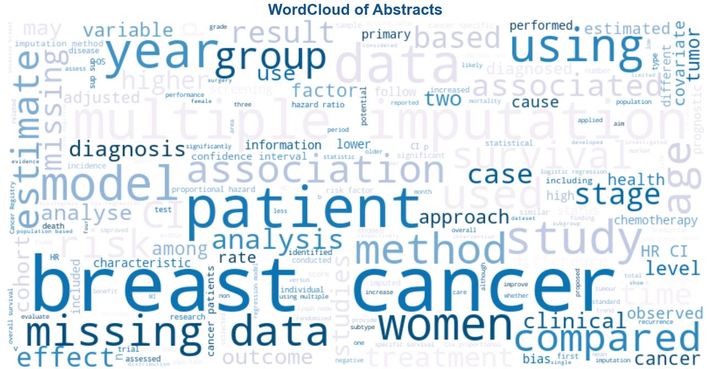
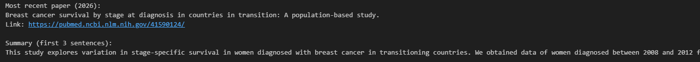

# PubMed Abstracts Project


## Overview

This project demonstrates a complete pipeline to extract, process, and analyze scientific abstracts from PubMed. It showcases data engineering, exploratory data analysis (EDA), and reproducible workflows using Python.

**Key features:**
- Extract abstracts from PubMed using user-defined search queries.
- Save results in CSV for traceability and reproducibility.
- Perform exploratory data analysis with professional visualizations.
- Highlight top journals, abstract trends over time, and word clouds.
- Modular and reusable functions for easy adaptation to other research topics.

---

## Project Structure
```
PUBMED_PROJECT/
│
├── 📄 README.md
│
├─ 📁 /data
│ └─ pubmed_abstracts.csv # Extracted abstracts
│
├─ 📁 /resources # Folder for images/screenshots
│ ├─ abs_lenght.png
│ ├─ abstracts_per_year.png
│ ├─ most_recent_abs.png
│ ├─ top_journals.png
│ └─ wordcloud.png
│
├─ 01_pubmed_extraction.ipynb # Notebook to extract PubMed abstracts
├─ 02_exploratory_analysis.ipynb # Notebook for EDA and visualizations
├─ .env # Environment file with API keys/email
```

---

## Getting Started

1. **Clone the repository**
```bash
git clone https://github.com/juliabeco/Pubmed_analysis.git
```

2. Install dependencies
```bash
pip install -r requirements.txt
```

3. Set up your .env file with your PubMed API email.

4. Run the extraction notebook 
```bash
   01_pubmed_extraction.ipynb
```

5. Perform exploratory data analysis
```bash
02_exploratory_analysis.ipynb
```

### **Skills Demonstrated**

- Python programming: Pandas, NumPy, Matplotlib, Seaborn

- Data extraction from APIs (PubMed / NCBI Entrez)

- Reproducible and modular pipeline

- Data visualization and storytelling:

- Bar charts with counts per year and top journals

- WordClouds for textual analysis

- Abstract length distributions

- Good practices in data science:

- Parameterized search queries

- CSV export for traceability

- Clear folder structure

- Annotated and readable code

## Example Visualizations

Top 10 Journals by Number of Abstracts


Number of Abstracts per Year


WordCloud of Abstracts


Most Recent Abstract Published


## Notes

- All code is written with clarity, modularity, and reproducibility in mind.
- The project focuses on data extraction, structuring, and exploratory analysis of scientific literature.
- It provides a solid foundation for:
  - Descriptive analysis of publication trends over time
  - Journal-level analysis and comparison
  - Basic exploration of abstract text data
- Possible future improvements include:
  - Parameterizing search queries and time ranges
  - Adding keyword frequency analysis across years
  - Comparing publication patterns between journals
  - Automating the full pipeline from data extraction to analysis
- Designed for portfolio purposes to demonstrate data analytics skills, EDA, and a structured workflow in a healthcare-related context.
- The idea for this project was inspired by discussions with my friend and colleague, Laura Aballay.
